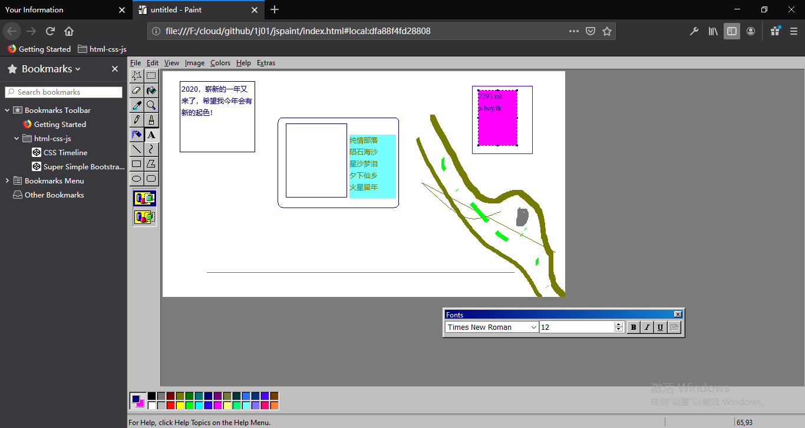

# somedir
实力开发者超级程序组合包
a package for developers, including [Java:ImageJ,GeoGebra,Fleet,weed;Python3,nodejs,nw.js,7zip,notepad++,tide,...]

update date: 2020-01-17

## Files Tree 目录树

## Download and Usage 下载和使用

## Construction 构建
### 基础软件
- 7-Zip	F:\Program\7-Zip	https://www.7-zip.org/	https://www.7-zip.org/a/7z1902-x64.exe
- chromium https://download-chromium.appspot.com/	[ https://download-chromium.appspot.com/?platform=Win_x64&type=snapshots  https://commondatastorage.googleapis.com/chromium-browser-snapshots/Win_x64/732653/chrome-win.zip ]
    F:\app\chrome-win\chrome.exe --user-data-dir=../browserData  
    F:\app\chromeextensions  

- firefox developer edition "C:\Program Files\Firefox Developer Edition"	https://www.mozilla.org/zh-CN/firefox/all/#product-desktop-developer	https://download-installer.cdn.mozilla.net/pub/devedition/releases/73.0b6/win64/zh-CN/Firefox%20Setup%2073.0b6.exe
  > Firefox开发者版安装在C盘,保存的密码和个人数据不会出现在somedir-2020xxxx.7z发布包中

- yandex.Browser
- /× yandex.disk	https://disk.yandex.ru/download?src=Yandex.Sidebar#pc ×/
- Microsoft Edge 版本 79.0.309.65 (官方内部版本) (64 位)此浏览器基于 Chromium 开源项目及其他 开源软件。Microsoft Edge© 2020 Microsoft Corporation

### html javascript  css
- nodejs	F:\nodejs	https://nodejs.org	https://nodejs.org/dist/v13.6.0/node-v13.6.0-x64.msi
- jsshell		https://download-installer.cdn.mozilla.net/pub/devedition/releases/73.0b6/jsshell/
- nwjs	F:\app\nwjs-sdk	https://github.com/nwjs/nw.js/	https://dl.nwjs.io/v0.43.5/nwjs-sdk-v0.43.5-win-x64.zip

### Java
- openjdk	F:\Java\openjdk http://jdk.java.net/	https://download.java.net/java/GA/jdk13.0.2/d4173c853231432d94f001e99d882ca7/8/GPL/openjdk-13.0.2_windows-x64_bin.zip
- Eclipse	F:\jbox\eclipse	https://www.eclipse.org/	https://www.eclipse.org/downloads/download.php?file=/technology/epp/downloads/release/2019-12/R/eclipse-jee-2019-12-R-win32-x86_64.zip&mirror_id=1082
- Netbeans	F:\jbox\netbeans netbeans.org	http://mirrors.gigenet.com/apache/netbeans/netbeans/11.2/netbeans-11.2-bin.zip
- GeoGebra
- ImageJ
- Greenfoot

### Python3
- python	F:\Python	https://www.python.org	https://www.python.org/ftp/python/3.8.1/python-3.8.1-amd64.exe

### C
- TinyCC	F:\tcc	https://bellard.org/tcc/	[ http://download.savannah.gnu.org/releases/tinycc/tcc-0.9.27-win64-bin.zip  http://download.savannah.gnu.org/releases/tinycc/winapi-full-for-0.9.27.zip ]	

## game
starcraft 1.08	F:\game\starcraft

## chrome setting and extensions
chrome://chrome-urls/
chrome://flags/

Experimental Web Platform features
Enables experimental Web Platform features that are in development. – Mac, Windows, Linux, Chrome OS, Android

#enable-experimental-web-platform-features

Developer Tools experiments
Enables Developer Tools experiments. Use Settings panel in Developer Tools to toggle individual experiments. – Mac, Windows, Linux, Chrome OS

#enable-devtools-experiments

Parallel downloading
Enable parallel downloading to accelerate download speed. – Mac, Windows, Linux, Chrome OS, Android

#enable-parallel-downloading

F:\app\chromeextensions\
SwitchySharp

## books

## wonderful github repos
https://github.com/1j01/jspaint	F:\cloud\github\1j01\jspaint
https://github.com/gsantner/markor

## screenshots

